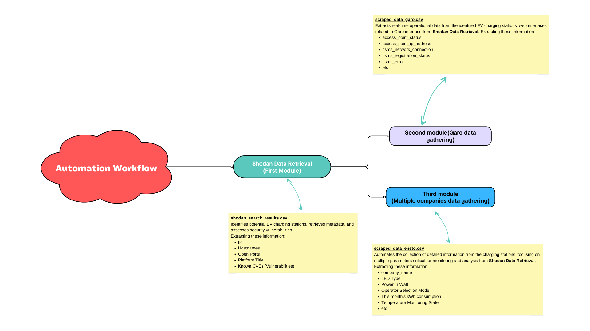

# Electric Vehicle Charging Station Data Collector

[](https://opensource.org/licenses/MIT)

**Note:** This project assumes proper handling of Shodan API keys and adherence to ethical data usage practices. Ensure compliance with Shodan's terms of service. This repository is for educational purposes only.


## Project Overview
The Electric Vehicle Charging Station Data Collector is a comprehensive solution for collecting, analyzing, and monitoring data from various EV charging stations. The project consists of three interconnected Python modules that leverage Shodan for initial data discovery, data gathering for real-time data extraction, and for detailed information retrieval in a full automated way.

## Project Workflow



1. **Shodan Data Retrieval:** Identifies potential charging stations and assesses security vulnerabilities.
    <details>
    <summary><b>Data Overview</b> (Click to see details)</summary>
    The dataset includes information on various charging stations, comprising columns such as IP addresses, hostnames, open ports, titles, and known Common Vulnerabilities and Exposures (CVEs). This data was collected using Shodan API, offering a snapshot of the current landscape of publicly available charging infrastructure.
    </details>


2. **Garo Data Gathering:** Extracts real-time operational data from charging stations' web interfaces.
    <details>
    <summary><b>Data Analysis and Insights</b> (Click to see details)</summary>
    
    - ### Connection Status Overview:
      - Understand the overall connection status of the charging stations.
      - Identify stations with consistently stable or unstable connections.
    
    - ### CSMS Connection Analysis:
      - Analyze the CSMS network connection details to ensure seamless communication with the central management system.
      - Identify stations facing registration issues or errors.
    
    - ### Ethernet Settings Evaluation:
      - Examine Ethernet settings to assess network configurations.
      - Identify stations with specific frequency or signal strength patterns.
    
    - ### Software Version Distribution:
      - Investigate the distribution of software versions across stations.
      - Identify stations that may require updates or maintenance.
    </details>


3. **Multiple Companies Data Gathering:** Retrieves detailed information for in-depth analysis and reporting.
    <details>
    <summary><b>Key Observations and Analysis</b> (Click to see details)</summary>
    
    - ### Station Information:
      - The CSV file includes URLs for each charging station, providing a direct link to their respective states.
    
    - ### Operational Parameters:
      - The dataset covers various operational parameters, including LED type, power in watts, operator selection mode, temperature monitoring state, etc.
    
    - ### Charging States:
      - Charging station states, represented by "IDLE," "CONNECTED," or "DISABLED," provide insights into the availability and readiness of the stations for charging.
    
    - ### Physical Security Indicators:
      - "Plug not locked" messages indicate potential physical security risks.
    
    - ### Metering Information:
      - Meter configurations, such as Modbus Meter ABB, are present. Securing these meters is crucial for accurate billing and preventing fraudulent activities.
    
    - ### Communication Details:
      - Mobile network details, including ICCID, IMSI, and IMEI, are provided.
     
    - ### Energy Consumption:
      - Energy-related parameters, such as energy in watt-hours and charging current, offer insights into consumption patterns.
    
    - ### Security States:
      - OCPP states, including "CONNECTED" or "DISABLED," require close monitoring for secure communication. An "IDLE" state signifies readiness for charging.
      
    </details>


## Features
- **Shodan Data Retrieval Script (`main.py`):**
  - Identifies EV charging stations using Shodan.
  - Gathers metadata, open ports, and known vulnerabilities.
  - Assesses security risks before proceeding with data extraction.

- **Web Scraping Script (`garo.py`):**
  - Collects real-time operational data from EV charging stations' web interfaces.
  - Utilizes asynchronous web scraping techniques to extract critical information.

- **Data Gathering Script (`ensto.py`):**
  - Automates the retrieval of detailed information from charging stations.
  - Focuses on EVSE access-point details, CSMS connection information, and more.
  - Utilizes asynchronous requests and BeautifulSoup for HTML parsing.


## Getting Started

### Prerequisites
- Python 3.x
- Shodan API Key

### Installation

1. **Create a `.env` file:**
    ```bash
    git clone https://github.com/signorrayan/EVCSMS-Data-Collector.git
    cd EVCSMS-Data-Collector
    echo 'SHODAN_API_KEY = "<YOUR_KEY_HERE>"' > .env
    ```

2. **Install requirements:**
    ```bash
    python3 -m venv venv
    source venv/bin/activate
    python3 -m pip install -r requirements.txt
    ```

### Usage
3. **Run the script:**
    ```bash
    python3 main.py
    ```
The results (3 csv data collection) will be stored in the following directory: `results/*.csv`

## License
This project is licensed under the MIT License - see the [LICENSE](LICENSE) file for details.

---
Happy monitoring! 🚗⚡
